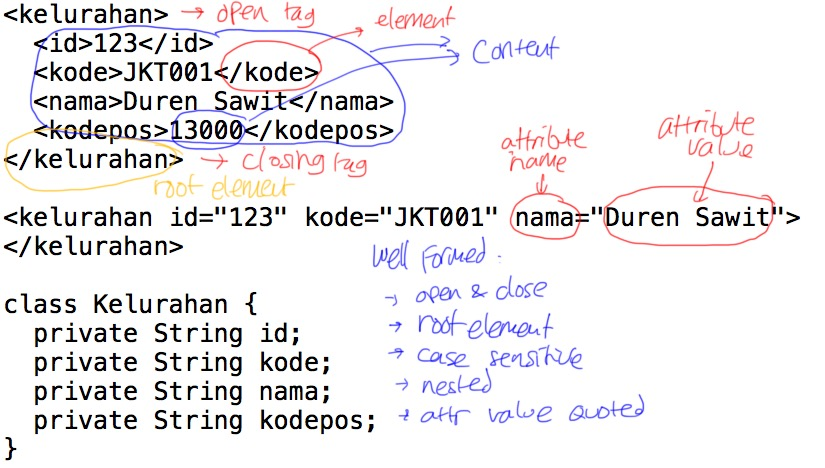
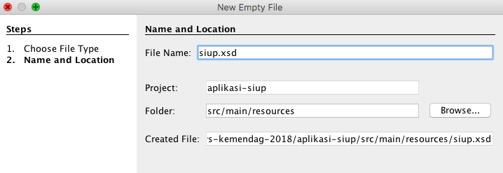
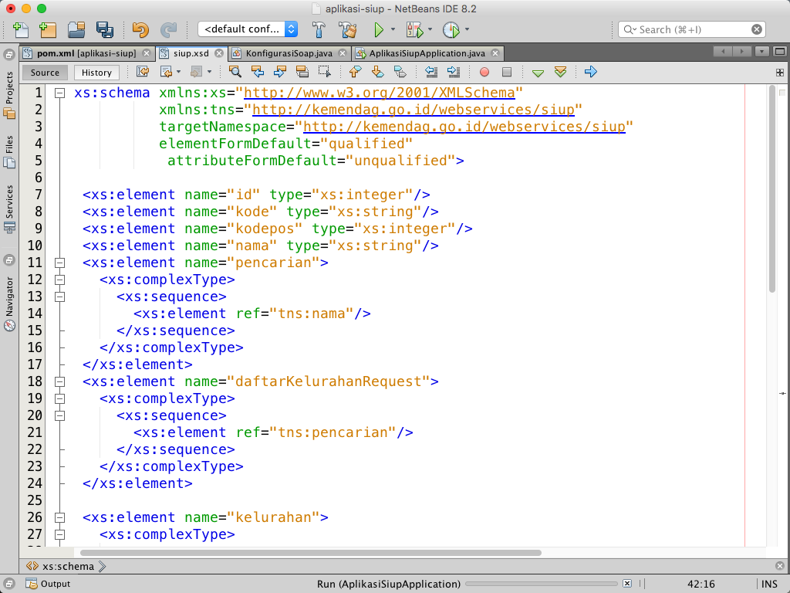

# Membuat Web Service SOAP dengan Spring #

Langkah-langkah:

1. Membuat contoh XML yang akan digunakan dalam aplikasi. Misal : data kelurahan
2. Membuat XSD dari contoh XML. Bisa menggunakan layanan online seperti misalnya [Free Formatter](https://www.freeformatter.com/xsd-generator.html)
3. Membuat project Spring
4. Menambahkan dependensi library untuk SOAP dengan Spring
5. Memasang plugin untuk generate kode Java dari XSD
6. Menambahkan XSD ke dalam project
7. Membuat konfigurasi aplikasi web services
8. Menjalankan aplikasi

## Konsep XML ##

Aturan membuat data XML

* Prolog

    ```xml
    <?xml version="1.0" encoding="UTF-8"?>
    ```

* Root Element : cuma boleh ada satu, misalnya `kelurahan`

    ```xml
    <kelurahan>
      <id>123</id>
      <kode>JKT001</kode>
      <nama>Duren Sawit</nama>
      <kodepos>13000</kodepos>
    </kelurahan>
    ```

* Closing tag harus ada
* Tag case sensitif
* Nesting harus benar

    Ini benar :

    ```xml
    <kelurahan><kode>123</kode></kelurahan>
    ```

    Ini salah :

    ```xml
    <kelurahan><kode>123</kelurahan></kode>
    ```

* Atribut harus pakai tanda kutip

    ```xml
    <kode="123" />
    ```

* Karakter khusus (`<`, `>`, `&`, `'`, `"`) harus pakai escape (`&lt;`, `&gt;`, `&amp;`, `&apos;`, `&quot;`)

XML yang sesuai aturan di atas disebut `well formed`

[](img/04-komponen-xml.jpg)

## Contoh File XML ##

```xml
<?xml version="1.0" encoding="UTF-8"?>
<daftarKelurahanResponse>
  <daftarKelurahan>
    <kelurahan>
      <id>123</id>
      <kode>JKT001</kode>
      <nama>Duren Sawit</nama>
      <kodepos>13000</kodepos>
    </kelurahan>
    <kelurahan>
      <id>123</id>
      <kode>JKT001</kode>
      <nama>Duren Sawit</nama>
      <kodepos>13000</kodepos>
    </kelurahan>
    <kelurahan>
      <id>123</id>
      <kode>JKT001</kode>
      <nama>Duren Sawit</nama>
      <kodepos>13000</kodepos>
    </kelurahan>
  </daftarKelurahan>
</daftarKelurahanResponse>
```

## Generate XSD ##

Buat XSD untuk contoh XML di atas. 

[](img/05-generate-xsd.png)

Nantinya bila kita menambah jenis XML, jangan lupa generate XSDnya lagi. XSD hasil generate bisa ditambahkan di XSD yang sudah ada.

XSD yang sudah didapatkan biasanya perlu diedit lagi untuk memperbaiki tipe data dan namespace.

Berikut hasil generate

```xml
<xs:schema attributeFormDefault="unqualified" elementFormDefault="qualified" xmlns:xs="http://www.w3.org/2001/XMLSchema">
  <xs:element name="id" type="xs:byte"/>
  <xs:element name="kode" type="xs:string"/>
  <xs:element name="nama" type="xs:string"/>
  <xs:element name="kodepos" type="xs:short"/>
  <xs:element name="kelurahan">
    <xs:complexType>
      <xs:sequence>
        <xs:element ref="id"/>
        <xs:element ref="kode"/>
        <xs:element ref="nama"/>
        <xs:element ref="kodepos"/>
      </xs:sequence>
    </xs:complexType>
  </xs:element>
  <xs:element name="daftarKelurahan">
    <xs:complexType>
      <xs:sequence>
        <xs:element ref="kelurahan" maxOccurs="unbounded" minOccurs="0"/>
      </xs:sequence>
    </xs:complexType>
  </xs:element>
  <xs:element name="daftarKelurahanResponse">
    <xs:complexType>
      <xs:sequence>
        <xs:element ref="daftarKelurahan"/>
      </xs:sequence>
    </xs:complexType>
  </xs:element>
</xs:schema>
```

Dan berikut yang sudah diperbaiki dan digabungkan

```xml
<xs:schema xmlns:xs="http://www.w3.org/2001/XMLSchema" 
           xmlns:tns="http://kemendag.go.id/webservices/siup"
           targetNamespace="http://kemendag.go.id/webservices/siup" 
           elementFormDefault="qualified"
            attributeFormDefault="unqualified">
    
  <xs:element name="id" type="xs:integer"/>
  <xs:element name="kode" type="xs:string"/>
  <xs:element name="kodepos" type="xs:integer"/>
  <xs:element name="nama" type="xs:string"/>
  <xs:element name="pencarian">
    <xs:complexType>
      <xs:sequence>
        <xs:element ref="tns:nama"/>
      </xs:sequence>
    </xs:complexType>
  </xs:element>
  <xs:element name="daftarKelurahanRequest">
    <xs:complexType>
      <xs:sequence>
        <xs:element ref="tns:pencarian"/>
      </xs:sequence>
    </xs:complexType>
  </xs:element>
  
  <xs:element name="kelurahan">
    <xs:complexType>
      <xs:sequence>
        <xs:element ref="tns:id"/>
        <xs:element ref="tns:kode"/>
        <xs:element ref="tns:nama"/>
        <xs:element ref="tns:kodepos"/>
      </xs:sequence>
    </xs:complexType>
  </xs:element>
  <xs:element name="daftarKelurahan">
    <xs:complexType>
      <xs:sequence>
        <xs:element ref="tns:kelurahan" maxOccurs="unbounded" minOccurs="0"/>
      </xs:sequence>
    </xs:complexType>
  </xs:element>
  <xs:element name="daftarKelurahanResponse">
    <xs:complexType>
      <xs:sequence>
        <xs:element ref="tns:daftarKelurahan"/>
      </xs:sequence>
    </xs:complexType>
  </xs:element>
</xs:schema>
```

## Dependensi Library SOAP dengan Spring ##

Tambahkan dependensi berikut di `pom.xml`

```xml
<dependency>
    <groupId>org.springframework.boot</groupId>
    <artifactId>spring-boot-starter-web-services</artifactId>
</dependency>
<dependency>
    <groupId>wsdl4j</groupId>
    <artifactId>wsdl4j</artifactId>
</dependency>
```

Kemudian, pasang plugin untuk membuat class Java sesuai XSD

```xml
<plugin>
    <groupId>org.codehaus.mojo</groupId>
    <artifactId>jaxb2-maven-plugin</artifactId>
    <version>1.6</version>
    <executions>
        <execution>
            <id>xjc</id>
            <goals>
                <goal>xjc</goal>
            </goals>
        </execution>
    </executions>
    
    <configuration>
        <schemaDirectory>${project.basedir}/src/main/resources/</schemaDirectory>
    </configuration>
</plugin>
```

## Memasang file XSD ke project ##

Klik kanan `Other Sources` di Netbeans

[](img/06-create-empty-file.png)

Kalau pilihan `Empty File` belum ada, pilih `Other...` dulu lalu cari di sana.

Berikan nama file `siup.xsd`

[](img/07-nama-file-xsd.png)

Copy paste `XSD` yang sudah disesuaikan pada langkah sebelumnya

[](img/08-isi-file-xsd.png)

