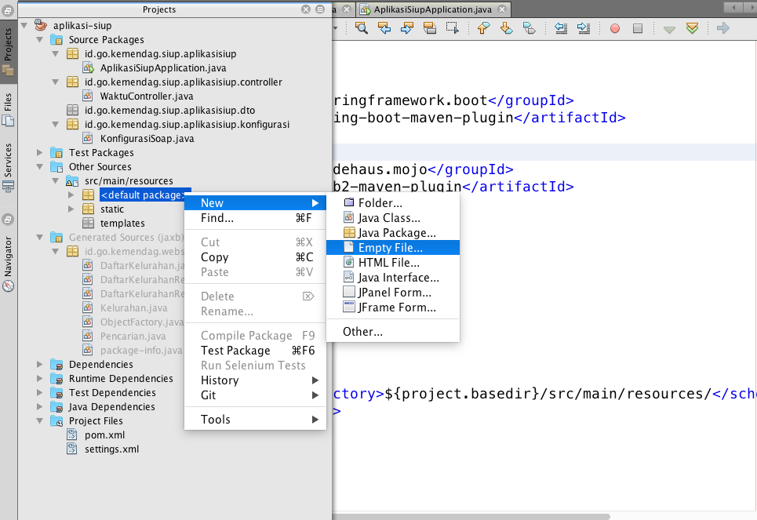
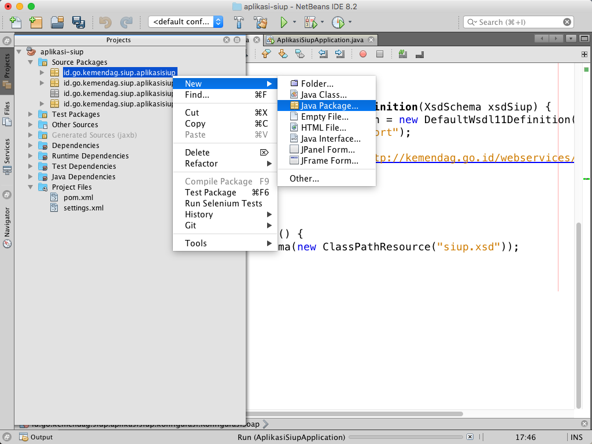
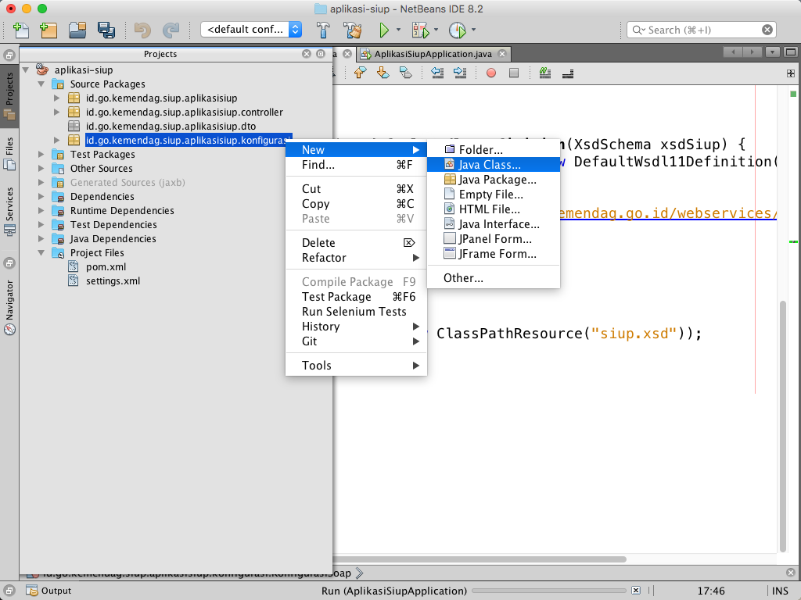
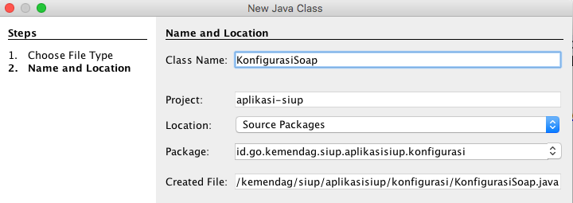

# Membuat Web Service SOAP dengan Spring #

Langkah-langkah:

1. [Membuat contoh XML yang akan digunakan dalam aplikasi. Misal : data kelurahan](#konsep-xml)
2. [Membuat XSD dari contoh XML](#generate-xsd). Bisa menggunakan layanan online seperti misalnya [Free Formatter](https://www.freeformatter.com/xsd-generator.html)
3. Membuat project Spring
4. [Menambahkan dependensi library untuk SOAP dengan Spring](#dependensi-library-soap-dengan-spring)
5. [Memasang plugin untuk generate kode Java dari XSD](#plugin-untuk-membuat-class-java-sesuai-xsd)
6. [Menambahkan XSD ke dalam project](#memasang-file-xsd-ke-project)
7. [Membuat konfigurasi aplikasi web services](#membuat-konfigurasi-spring-untuk-aplikasi-soap)
8. [Menjalankan aplikasi](#menjalankan-aplikasi)

## Konsep XML ##

Aturan membuat data XML

* Prolog

    ```xml
    <?xml version="1.0" encoding="UTF-8"?>
    ```

* Root Element : cuma boleh ada satu, misalnya `kelurahan`

    ```xml
    <kelurahan>
      <id>123</id>
      <kode>JKT001</kode>
      <nama>Duren Sawit</nama>
      <kodepos>13000</kodepos>
    </kelurahan>
    ```

* Closing tag harus ada
* Tag case sensitif
* Nesting harus benar

    Ini benar :

    ```xml
    <kelurahan><kode>123</kode></kelurahan>
    ```

    Ini salah :

    ```xml
    <kelurahan><kode>123</kelurahan></kode>
    ```

* Atribut harus pakai tanda kutip

    ```xml
    <kode="123" />
    ```

* Karakter khusus (`<`, `>`, `&`, `'`, `"`) harus pakai escape (`&lt;`, `&gt;`, `&amp;`, `&apos;`, `&quot;`)

XML yang sesuai aturan di atas disebut `well formed`

[](img/04-komponen-xml.jpg)

## Contoh File XML ##

```xml
<?xml version="1.0" encoding="UTF-8"?>
<daftarKelurahanResponse>
  <daftarKelurahan>
    <kelurahan>
      <id>123</id>
      <kode>JKT001</kode>
      <nama>Duren Sawit</nama>
      <kodepos>13000</kodepos>
    </kelurahan>
    <kelurahan>
      <id>123</id>
      <kode>JKT001</kode>
      <nama>Duren Sawit</nama>
      <kodepos>13000</kodepos>
    </kelurahan>
    <kelurahan>
      <id>123</id>
      <kode>JKT001</kode>
      <nama>Duren Sawit</nama>
      <kodepos>13000</kodepos>
    </kelurahan>
  </daftarKelurahan>
</daftarKelurahanResponse>
```

## Generate XSD ##

Buat XSD untuk contoh XML di atas. 

[](img/05-generate-xsd.png)

Nantinya bila kita menambah jenis XML, jangan lupa generate XSDnya lagi. XSD hasil generate bisa ditambahkan di XSD yang sudah ada.

XSD yang sudah didapatkan biasanya perlu diedit lagi untuk memperbaiki tipe data dan namespace.

Berikut hasil generate

```xml
<xs:schema attributeFormDefault="unqualified" elementFormDefault="qualified" xmlns:xs="http://www.w3.org/2001/XMLSchema">
  <xs:element name="id" type="xs:byte"/>
  <xs:element name="kode" type="xs:string"/>
  <xs:element name="nama" type="xs:string"/>
  <xs:element name="kodepos" type="xs:short"/>
  <xs:element name="kelurahan">
    <xs:complexType>
      <xs:sequence>
        <xs:element ref="id"/>
        <xs:element ref="kode"/>
        <xs:element ref="nama"/>
        <xs:element ref="kodepos"/>
      </xs:sequence>
    </xs:complexType>
  </xs:element>
  <xs:element name="daftarKelurahan">
    <xs:complexType>
      <xs:sequence>
        <xs:element ref="kelurahan" maxOccurs="unbounded" minOccurs="0"/>
      </xs:sequence>
    </xs:complexType>
  </xs:element>
  <xs:element name="daftarKelurahanResponse">
    <xs:complexType>
      <xs:sequence>
        <xs:element ref="daftarKelurahan"/>
      </xs:sequence>
    </xs:complexType>
  </xs:element>
</xs:schema>
```

Dan berikut yang sudah diperbaiki dan digabungkan

```xml
<xs:schema xmlns:xs="http://www.w3.org/2001/XMLSchema" 
           xmlns:tns="http://kemendag.go.id/webservices/siup"
           targetNamespace="http://kemendag.go.id/webservices/siup" 
           elementFormDefault="qualified"
            attributeFormDefault="unqualified">
    
  <xs:element name="id" type="xs:integer"/>
  <xs:element name="kode" type="xs:string"/>
  <xs:element name="kodepos" type="xs:integer"/>
  <xs:element name="nama" type="xs:string"/>
  <xs:element name="pencarian">
    <xs:complexType>
      <xs:sequence>
        <xs:element ref="tns:nama"/>
      </xs:sequence>
    </xs:complexType>
  </xs:element>
  <xs:element name="daftarKelurahanRequest">
    <xs:complexType>
      <xs:sequence>
        <xs:element ref="tns:pencarian"/>
      </xs:sequence>
    </xs:complexType>
  </xs:element>
  
  <xs:element name="kelurahan">
    <xs:complexType>
      <xs:sequence>
        <xs:element ref="tns:id"/>
        <xs:element ref="tns:kode"/>
        <xs:element ref="tns:nama"/>
        <xs:element ref="tns:kodepos"/>
      </xs:sequence>
    </xs:complexType>
  </xs:element>
  <xs:element name="daftarKelurahan">
    <xs:complexType>
      <xs:sequence>
        <xs:element ref="tns:kelurahan" maxOccurs="unbounded" minOccurs="0"/>
      </xs:sequence>
    </xs:complexType>
  </xs:element>
  <xs:element name="daftarKelurahanResponse">
    <xs:complexType>
      <xs:sequence>
        <xs:element ref="tns:daftarKelurahan"/>
      </xs:sequence>
    </xs:complexType>
  </xs:element>
</xs:schema>
```

## Dependensi Library SOAP dengan Spring ##

Tambahkan dependensi berikut di `pom.xml`

```xml
<dependency>
    <groupId>org.springframework.boot</groupId>
    <artifactId>spring-boot-starter-web-services</artifactId>
</dependency>
<dependency>
    <groupId>wsdl4j</groupId>
    <artifactId>wsdl4j</artifactId>
</dependency>
```

## Plugin untuk membuat class Java sesuai XSD ##

Tambahkan plugin berikut di `pom.xml`

```xml
<plugin>
    <groupId>org.codehaus.mojo</groupId>
    <artifactId>jaxb2-maven-plugin</artifactId>
    <version>1.6</version>
    <executions>
        <execution>
            <id>xjc</id>
            <goals>
                <goal>xjc</goal>
            </goals>
        </execution>
    </executions>
    
    <configuration>
        <schemaDirectory>${project.basedir}/src/main/resources/</schemaDirectory>
    </configuration>
</plugin>
```

## Memasang file XSD ke project ##

Klik kanan `Other Sources` di Netbeans

[](img/06-create-empty-file.png)

Kalau pilihan `Empty File` belum ada, pilih `Other...` dulu lalu cari di sana.

Berikan nama file `siup.xsd`

[](img/07-nama-file-xsd.png)

Copy paste `XSD` yang sudah disesuaikan pada langkah sebelumnya

[](img/08-isi-file-xsd.png)

## Membuat Konfigurasi Spring untuk Aplikasi SOAP ##

Buat package baru di dalam `id.go.kemendag.siup.aplikasisiup`

[](img/09-buat-package-konfigurasi.png)

Beri nama yang sesuai

[](img/10-nama-package-konfigurasi.png)

Buat class Java di dalam package yang baru dibuat tadi

[](img/11-buat-class-konfigurasi-soap.png)

Beri nama yang sesuai, misalnya `KonfigurasiSoap`

[](img/12-nama-class-konfigurasi-soap.png)

Isinya bisa [dilihat di sini](../aplikasi-siup/src/main/java/id/go/kemendag/siup/aplikasisiup/konfigurasi/KonfigurasiSoap.java)

## Menjalankan Aplikasi ##

Aplikasi bisa dijalankan dengan klik Run pada main class, yaitu `AplikasiSiupApplication`

[](img/13-run-app.png)

Setelah jalan, kita bisa browse ke url `/ws/siup.wsdl` untuk melihat WSDL aplikasi kita.

[](img/14-wsdl.png)

## Implementasi Endpoint ##

Endpoint adalah class method yang akan menghandle SOAP Request. Endpoint di Spring WS memasangkan antara method yang akan dijalankan dengan `Root Element` XML yang ada dalam `SOAP Body`. 

Sebagai ilustrasi, misalnya SOAP Request kita seperti ini

```xml
<soapenv:Envelope xmlns:soapenv="http://schemas.xmlsoap.org/soap/envelope/"
				  xmlns:siup="http://kemendag.go.id/webservices/siup">
  <soapenv:Header/>
  <soapenv:Body>

    <siup:daftarKelurahanRequest>
      <siup:pencarian>
        <siup:nama>Cili</siup:nama>
      </siup:pencarian>
    </siup:daftarKelurahanRequest>
  </soapenv:Body>
</soapenv:Envelope>
```

Maka endpoint yang akan menangani request tersebut seperti ini

```java
@Endpoint
public class KelurahanEndpoint {
    
    @PayloadRoot(localPart = "daftarKelurahanRequest", namespace = "http://kemendag.go.id/webservices/siup")
    @ResponsePayload
    public DaftarKelurahanResponse cariKelurahan(@RequestPayload DaftarKelurahanRequest request){
        DaftarKelurahanResponse resp = new DaftarKelurahanResponse();
        
        // query database dan isikan data kelurahan ke dalam resp

        return resp;
    }
}
```

## Konversi XML ke Java ##

Pada saat menerima data berupa XML, misalnya seperti ini:

```xml
<daftarKelurahanRequest>
  <pencarian>
    <nama>Cili</nama>
  </pencarian>
</daftarKelurahanRequest>
```

maka kita ingin mengubahnya menjadi objek Java, sehingga kita bisa proses seperti ini

```java
public DaftarKelurahanResponse cariKelurahan(@RequestPayload DaftarKelurahanRequest request){
        String cariNamaKelurahan = request.getPencarian().getNama();
        System.out.println("Mencari kelurahan dengan nama "+ cariNamaKelurahan);
}
```

Untuk itu, kita buat Java class seperti ini

```java
public class DaftarKelurahanRequest {
    private Pencarian pencarian;
}
```

dan ini

```java
public class Pencarian {
    private String nama;
}
```

Demikian juga untuk responsenya. Kita perlu mengubah dari Java object menjadi XML.

Agar konversi Java <--> XML bisa dilakukan secara otomatis (tidak perlu parsing XML secara manual), Java sudah menyediakan library yang bernama `JAXB`, singkatan dari Java API for XML Binding. Kita cukup memasang annotation di class yang akan menjadi `Root Element`, yaitu `DaftarKelurahanRequest` seperti ini

```java
@XmlAccessorType(XmlAccessType.FIELD)
@XmlRootElement(
        name = "daftarKelurahanRequest", 
        namespace = "http://kemendag.go.id/webservices/siup")
public class DaftarKelurahanRequest {
    private Pencarian pencarian;
}
```

Dengan annotation `@XmlRootElement`, maka XML bisa dikonversi secara otomatis menjadi object `daftarKelurahanRequest` seperti dalam deklarasi method endpoint

```java
public DaftarKelurahanResponse cariKelurahan(@RequestPayload DaftarKelurahanRequest request)
```

Pada annotation `@XmlRootElement` di atas, kita mendeklarasikan juga `namespace` yang digunakan. Bila class kita banyak, tentu akan ada banyak duplikasi deklarasi `namespace`. Untuk menghindari hal tersebut, kita deklarasi sekali saja dalam file `package-info.java` seperti ini

```java
@XmlSchema( 
    namespace = "http://kemendag.go.id/webservices/siup", 
    elementFormDefault = XmlNsForm.QUALIFIED) 
package id.go.kemendag.siup.aplikasisiup.dto;
 
import javax.xml.bind.annotation.XmlNsForm;
import javax.xml.bind.annotation.XmlSchema;
```

Simpan file `package-info.java` di package/folder yang sama dengan class-class yang beranotasi `@XmlRootElement` tadi.

Annotation JAXB ini bisa kita buat sendiri secara manual, bisa juga secara otomatis dibuatkan berdasarkan XSD. Tidak ada bedanya antara yang dibuat manual ataupun hasil generate.